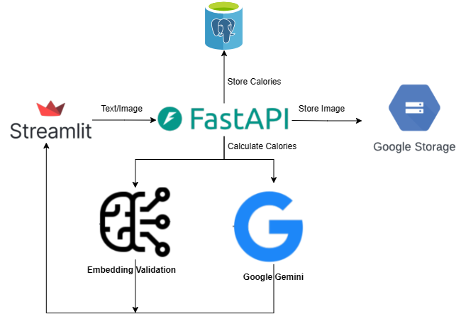
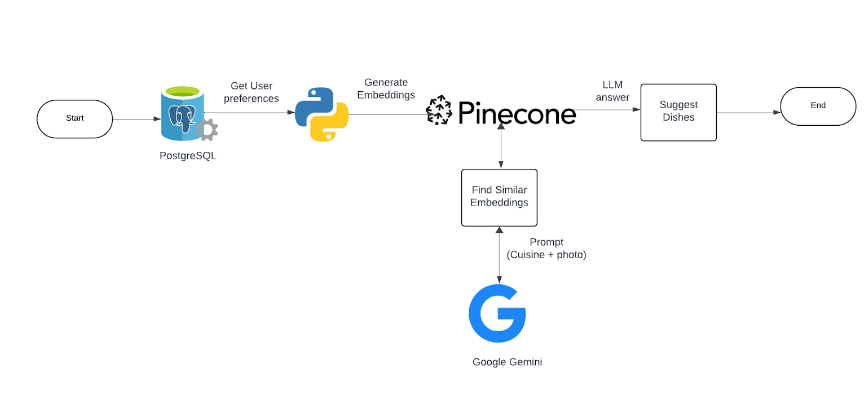
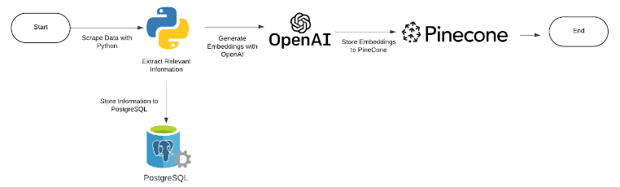

# NutriBuddy

The project aims to develop a personalized meal planner application that utilizes data from various sources, including nutritional databases, user input, and meal suggestion algorithms. The application will be developed using modern web and mobile technologies, leveraging frameworks such as React.js for frontend development and Node.js for backend functionality. The expected deliverables include a user-friendly interface for meal planning, calorie tracking features, personalized meal suggestions, and data visualization capabilities.

## Live application:

http://35.237.26.187:8501/Sign_In

## Documentation

## Data Sources

### Food.com - Recipes

The recipes dataset contains 522,517 recipes from 312 different categories. This dataset provides information about each recipe like cooking times, servings, ingredients, nutrition, instructions, and more.

## Tools and Technologies:

- FrontEnd : StreamLit
- Backend : FastAPI
- Database : PostGreSQL
- Cloud : GCP
- Create Embeddings: DistilBERT
- Automation : Airflow

## Pipelines

#### Capture Calories:

#### RAG to suggest Meals as per Calories

#### Model Training: Custom Model training for Cuisine classification and Calorie estimation

#### Data Scraping

## Steps to make it run on your machine

- Clone the github repository on local
- Create env file in ‘./airflow/config’; ‘./backend’; ‘./frontend’; and ‘./’ directories
- Create a virtual environment using ‘python -m venv ./venv’
- Make sure you have docker daemon running on your local machine
- Navigate to the project directory and run ‘docker compose build’ to build the images
- Then execute ‘docker compose up’ to run the images as containers
- To stop the running containers press Ctrl + C / Cmd + C and then execute docker compose down to remove the containers as a cleanup step

## References

- [DistilBERT](https://huggingface.co/docs/transformers/model_doc/distilbert)
